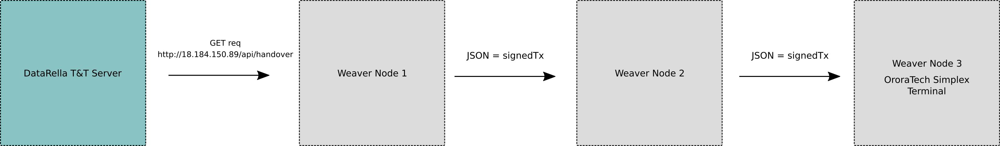

__WeaverMesh Network v0.01__

The WeaverMesh network implementation enables LoPy4 devices to perform unidirectional communcation using LoRa radio technology.

v0.01 demonstrates the following:

1.  Request a signed transaction in JSON form from the DataRella Track and Trust Blockchain
2.  Pass the JSON data through the WeaverMesh network using 3 LoPy devices that are LoRa enabled.
3. Pass the JSON data onto the Ororatech Simplex Terminal
4. Ororatech then transmits the signed transaction to a satellite.
5. The signed transaction is returned to an Ororatech ground receiver.
6. The ground received POSTS the signed transaction back to the DataRella Track and Trust blockchain.

__Installation__

<figure>

    
     
    <em>Fig. 1: Message Data Flow</em>
</figure>

*Initial Hardware Setup*
1. Follow the "Getting Started" instructions on the pycom website. (Located here: https://docs.pycom.io/gettingstarted/)
    - Weaver found the most reliable LoPy4 firmware to be LoPy4-1.20.0.rc12 (provided in this directory).
    - During the "Updating Firmware" steps of the hardware setup, it is recommnded to use the above mentioned firmware.

*WeaverMesh Software Installation*
1. The software for each node is maintained @ https://github.com/weaver-lab/ESA-Kickstarter-WLOTDR/tree/master/weaver

2. The corresponding software for each node is located in folders /Node1, /Node2 and /Node3.

3. Node 1 requires additional configuration in order to connect to your wlan network.
  - Once the Node 1 software has been downloaded, open mesh_config.py
    - The network dictionary will need to be updated with the following:
        - IP
        - Netmask
        - Gateway
        - DNS
        - ssid
        - password
    - This is required as Node 1 needs an internet connection in order to succesfully complete the GET request from the DataRella T&T server)

3. Flash each device with the corresponding software (i.e. Node1, Node2 or Node 3). I've done this in Atom using the pymakr extension. Make sure you only have one project folder open at a time :).

4. Once the devices are succesfully flashed the following should take place:
  1. Node 1 should perform the GET request and pass the signedTx onto Node 2.
  2. Node 2 should received the signedTx from Node 1 and pass it onto Node 3.
  3. White/blueish LED lights flashing mean that the node has received its payload

Notes:
- If the devices won't boot while connnected to Atom, they may require a hard flash. On Linux, this is performed via the following:
  - "pycom-fwtool-cli --port /dev/ttyACM0 erase_all" where ttyACMO is the dev id (you might need sudo on your machine)
  - Once you succesfully flash this way, you will need to reflash the device with the correct firmware and software as decribed above.

- I also noticed some stability issues with wlan() initialized on devices, although with the firmware rc12, the problem seemed to go away.
